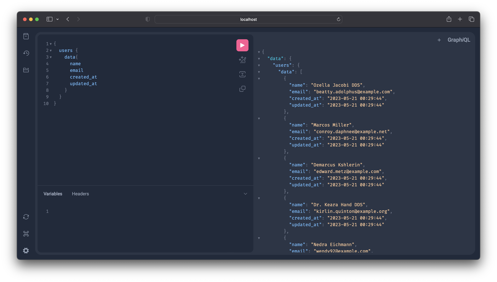

# 🕸️ Laravel GraphQl Example



## 🛠️ Technologies

- [Laravel](https://laravel.com/) The PHP Framework for Web Artisans.
- [Lighthouse](https://lighthouse-php.com/) A Lighthouse is a GraphQL framework for Laravel.
- [GraphQL Playground](https://github.com/mll-lab/laravel-graphiql) A GraphQL Playground UI for testing and exploring GraphQL APIs.

## 🚀 Installation

> **Note:** This project requires Git and Composer.

```bash
git clone

composer install

cp .env.example .env

php artisan key:generate

touch database/database.sqlite

php artisan migrate

php artisan db:seed

php artisan serve
```

Open [http://localhost:8000/graphql-playground](http://localhost:8000/graphql-playground) to view it in the browser.

## 📝 Usage

### Queries

Here are some example queries to try:

```graphql
{
    users {
        id
        name
        email
        posts {
            id
            title
            body
        }
    }
}
```

```graphql
{
    user(id: 1) {
        id
        name
        email
        posts {
            id
            title
            body
        }
    }
}
```

## 🧪 Testing

```bash
php artisan test
```

<!-- star -->
## ⭐ Support for this project

If you liked this project, please give it a star ⭐ & check out my [other projects](https://github.com/alphaolomi).

## 📄 License

This project is open-sourced software licensed under the [MIT license](https://opensource.org/licenses/MIT).
